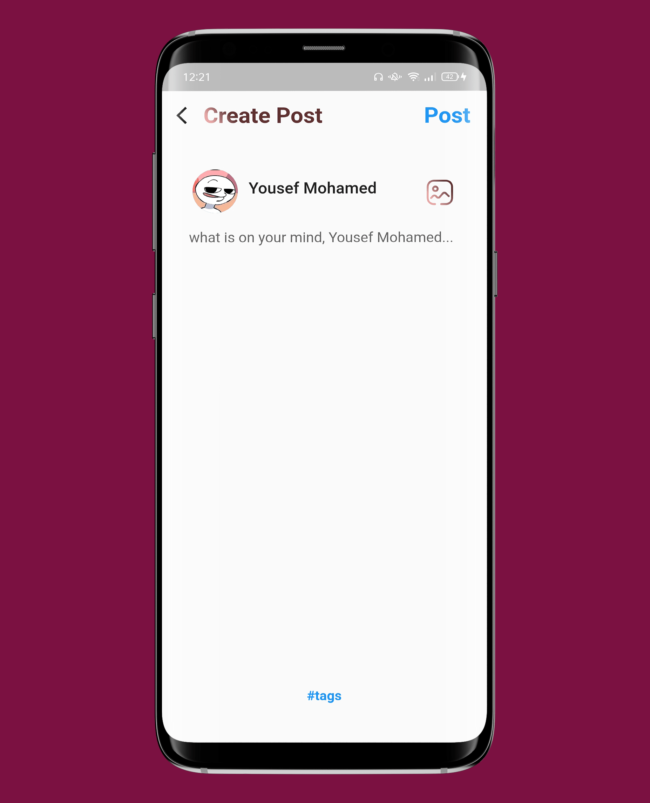
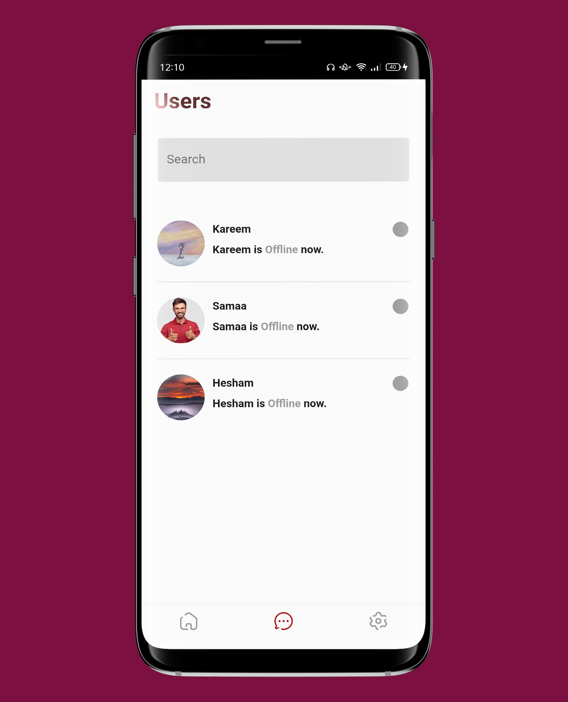
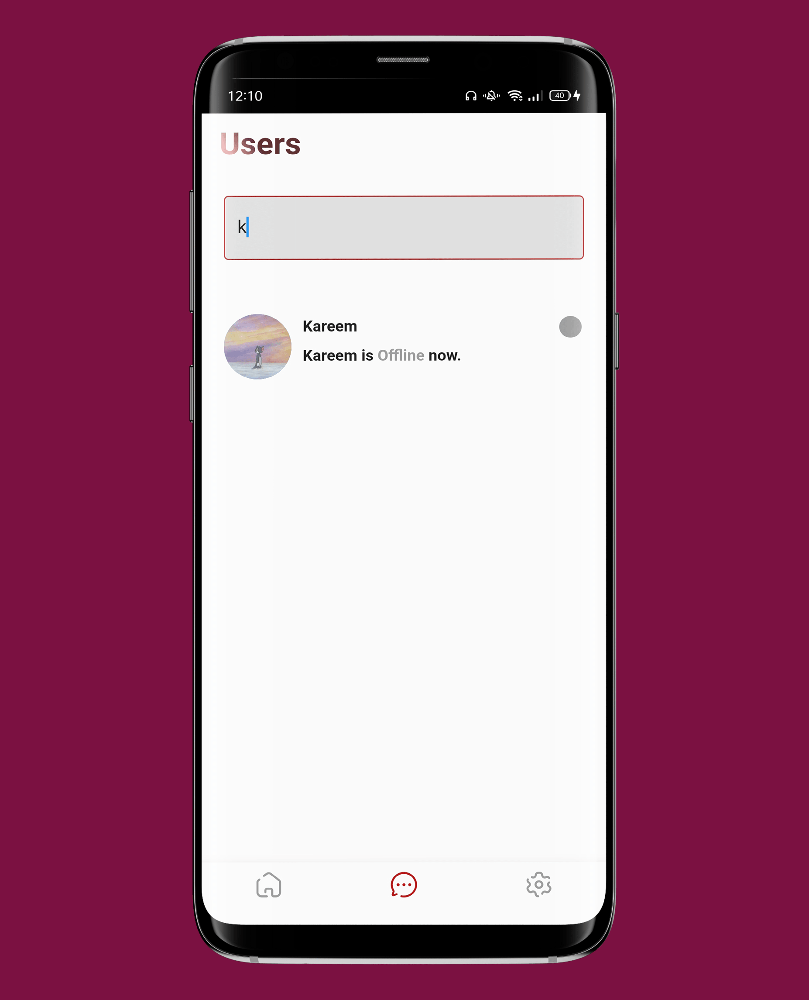

# ChatApp
Social media application using firebase as a backend.

# Screenshots

     
     
     
     
     
     
     
     
     
     
     
     
     
     
     
     
     
     
     
     
     
     
  
     

# Features
- Full authentication with firebase containing (Sign in, Sign up, logout).
- Save the user data when sign up or log in for the first time to keep logged in using Shared-Preferences.
- Back end validation and error handling incase of wrong inputs or technical issue.
- User can update his name ,bio ,phoneNumber ,coverImage ,userImage.
- Searching for users by username.
- Real-time messages.
- User can explore other user's profile and it shows his posts and his information.
- Knowing the state of the users whether offline or online.
- User can add posts with images and tags and can delete them later.
- User can react with posts by press like button.
- User can add comments and delete them.
- messages can be text or images.
- User can delete his messages for him or for everyOne.
- User can call his friends.
- User can view images in its full screen.
- Bloc as statemanagement.

## Getting Started

This project is a starting point for a Flutter application.

A few resources to get you started if this is your first Flutter project:

- [Lab: Write your first Flutter app](https://flutter.dev/docs/get-started/codelab)
- [Cookbook: Useful Flutter samples](https://flutter.dev/docs/cookbook)

For help getting started with Flutter, view our
[online documentation](https://flutter.dev/docs), which offers tutorials,
samples, guidance on mobile development, and a full API reference.
